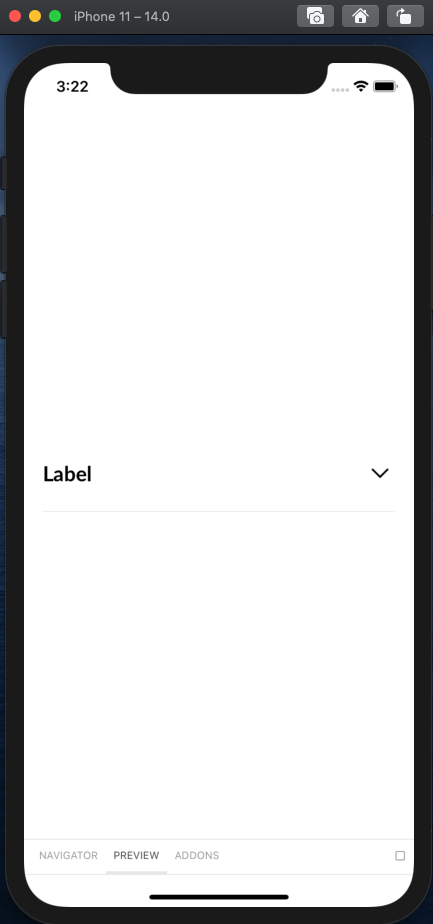

## Review of components

To review components easily we've used Storybook package so you can click through all the components used within the project. 

## Storybook
To run storybook on simulator go to `index.js` file and change `storybookEnabled` variable to true.
It will change app entry to storybook and you will have possibility to check all components.

Go to ``Navigator`` to open the menu. Interactive components are manageable through ``Addons`` tab.